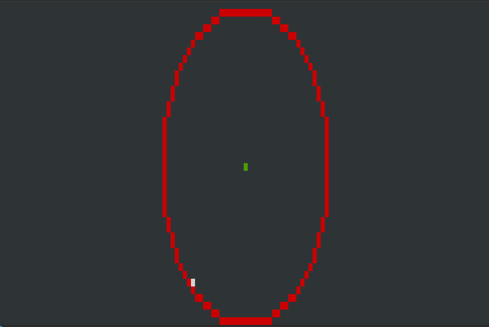

# red-circle-green-center
Red circle with green center drawn with Ncurses in C++ using the Midpoint Circle Algorithm in less than 60 lines of code :).

### compile with ` g++ main.c -lncurses` and run with `./a.cout`

